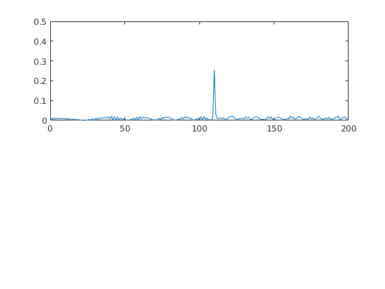
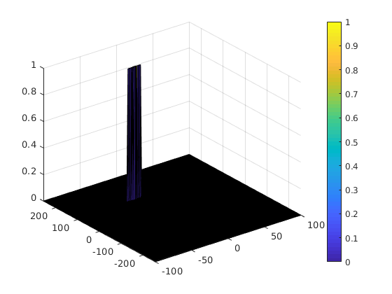

# Radar Target Generation and Detection

## Design the project process flow as below

### 1. Configure the FMCW waveform based on the system requirements.
###     set the range resolution, maximum range, define the target's initial position and velocity,in the project, velocity is constant.
###     c is speed of light, B_sweep is The sweep bandwidth, T_chirp is the sweep time, fc is the carrier frequency of radar, 77GHz.
- initial position 110m
- initial velocity -20m
- B_sweep = c /(2∗rangeResolution)
- T_chirp =5.5⋅2⋅R_max/c
- Slope=B_sweep/T_chirp

### 2. Target generation and radar signal processing
### 2.a Generate the range and velocity of target and simulate its displacement.
### 2.b For the same simulation loop process the transmit and receive signal to determine the beat signal

### 3. Perform Range FFT on the received signal to determine the Range
- Implement the 1D FFT on the Mixed Signal
- Reshape the vector into Nr*Nd array.
- Run the FFT on the beat signal along the range bins dimension (Nr)
- Normalize the FFT output.
- Take the absolute value of that output.
- Keep one half of the signal
- Plot the output
- There should be a peak at the initial position of the target
### Range FFT output

### 4. perform the 2D CFAR processing on the output of 2nd FFT to display the target.
- Determine the number of Training cells for each dimension. Similarly, pick the number of guard cells.
- Slide the cell under test across the complete matrix. Make sure the CUT has margin for Training and Guard cells from the edges.
- For every iteration sum the signal level within all the training cells. To sum convert the value from logarithmic to linear using db2pow function.
- Average the summed values for all of the training cells used. After averaging convert it back to logarithmic using pow2db.
- Further add the offset to it to determine the threshold.
- Next, compare the signal under CUT against this threshold.
If the CUT level > threshold assign it a value of 1, else equate it to 0.

### 2D CFAR output
